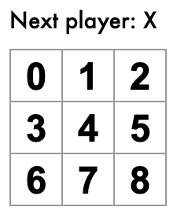

# README

세 가지 React 컴포넌트

* Square
  * `<button>`을 렌더링
* Board
  * 사각형 9개를 렌더링
* Game
  * 게임판을 렌더링. 나중에 수정할 자리 표시자 값을 가지고 있다.

## Square 컴포넌트와 Board 컴포넌트

Board가 부모이다. 

부모 Board 컴포넌트에서 자식 Square 컴포넌트로 props를 전달한다.


## Props를 통해 데이터 전달하기

### Board에서 Square 컴포넌트 props 전달

board에서 square컴포넌트로 데이터를 전달해야 한다.

square에 value prop을 전달하기 위해 board의 renderSquare 함수 코드를 수정

그 다음 값을 표시하기 위해 square의 render함수에 `{this.props.value}` 추가

여기까지 하면 화면에 숫자가 렌더링 된다.



### onClick 속성 넣기

사용자와 상호작용 할 수 있도록 square 컴포넌트를 클릭하면 'X'가 나와야함

```react
class Square extends Component {
    render() {
        return (
        <button
            className='square'
            onClick={() => {
                    alert('yes');
            }}>
            {this.props.value}
        </button>
      );
   }
}
```

### state 설정하기

square 컴포넌트를 클릭한 것을 '기억하게' 만들어 'X'가 표시되도록 해야 한다.

React 컴포넌트는 생성자에 this.state를 설정하는 것으로 state를 가질 수 있다.

현재 값을 this.state에 저장하고 square를 클릭하는 경우 변경되도록 한다.

1. 클래스에 생성자를 추가하여 state를 초기화한다.

```react
class Square extends Component {
    constructor(props) {
        super(props);
        this.state = {
            value: null;
        };
    }
}
```

2. render함수도 변경한다.

```react
class Square extends Component {
    constructor(props) {
        super(props);
        this.state = {
            value: null;
        };
    }
    
    render() {
        return (
        <button
            className='square'
            onClick={() => {
                this.setState({ value: 'X' });
            }}>
            {this.state.value}
        </button>
        );
    }
}
```

지금까지

* 버튼 태그 안의 this.props.value => this.state.value
* onClick 이벤트 핸들러를 onClick={() => {this.setState({value: 'X'})}} 로 변경
  * 이처럼 Square의 render 함수 내부에서 onClick핸들러를 통해 this.setState를 설정하는 것 만으로도 버튼을 클릭할 때 해당 컴포넌트가 렌더링되도록 할 수 있다.

## 부모의 자식 컴포넌트 설정하기

현재 모든 square 컴포넌트에서 각각 state를 갖고 있는데, 승자를 확인하기 위해선 9개의 square 값을 한 곳에서 확인할 수 있어야 한다.

어떻게? state를 각각의 square가 아니라 부모인 board에 저장한다. 그리고 부모인 board는 자식은 square에게 prop으로 상태를 전달 한다.

여러 개의 자식 컴포넌트로부터 데이터를 모으거나 두 개 이상의 자식 컴포넌트를 연결하려면 부모 컴포넌트에 공유 state를 정의해야 한다. 그래야 서로 동기화 할 수 있음

### Board 컴포넌트에 생성자 추가하기

board 컴포넌트에 생성자를 추가하고 9개의 사각형에 해당하는 9개의 null 배열을 초기 state로 설정해준다. 

이제 board에서 square로 vaule와 onClick 두 개의 props를 전달하게 된다.

### Square 컴포넌트 변경하기

스스로 상태를 정했던 square 컴포넌트를 부모인 board 컴포넌트에서 props를 받아 쓰는 자식 컴포넌트로 바꾼다.

* constructor 삭제 : 이제 square는 게임의 상태를 유지할 필요가 없기 때문에 생성자 삭제
* render : this.state.value => this.props.value로 바꾸기
* render : this.setState() => this.props.onClick()로 바꾸기

Square를 클릭하면 ?

square의 render() 함수에 정의된 onClick 이벤트를 호출한다. 그 다음 this.props.onClick()을 호출한다. 이 prop은 Board에 있다. Board에서 Square로 onClick={() => this.handleClick(i)}를 전달한다. 따라서 결과적으로 사각형을 클릭하면 this.handleClick(i) 를 호출한다.

### handleClick() 정의하기

```react
class Board extends Component {
    constructor(props) {
        super(props);
        this.state = {
            squares: Array(9).fill(null),
        };
    }
    
    handleClick(i) {
        const squares = this.state.squares.slice();
        squares[i] = 'X';
        this.setState({ squares: squares });
    }
}
```

squares를 클릭하면 사각형이 X로 변하는 것은 이전과 같지만, 이제는 state가 개별적인 square가 아니라 board에 저장된다. board 상태가 변할 때 square컴포넌트는 자동으로 다시 렌더링 된다. (board가 어떤 '승자'를 정할 수 있게 된다.)

square가 더이상 상태를 저장할 수 없게 되면서 square 컴포넌트는 controlled components가 된다.

## Immutability

Immutable data 즉 불변하는 데이터를 만들어놓는 것이 중요하다.

원본 데이터를 유지한 채 결과를 내는 것이 왜 중요할까?

1. Complex Features Become Simple: 이 게임을 할 때, 게임이 완료되면 초기의 값으로 돌아가야 한다. 특정 액션을 실행하고 다시 취소하는 기능은 대부분의 개발에서 필요한 기능이다. 따라서 초기의 데이터를 유지해둔다면 나중에 재사용하는 것이 간단하고 용이하다.
2. Detecting Changes: 변화된 부분을 체크할 때, 이미 수정된 데이터 자체에서 알아내려고 하기 보다는 복제한 데이터를 변화시켜서 기존의 데이터와 비교하는 것이 쉽다.
3. Determining When to Re-Render in React: Immutability의 가장 큰 장점은 React에서 **Pure Components**를 만드는 데 도움을 준다는 것이다. 변화된 부분을 체크하는 것이 쉬워진다면 이를 바탕으로 컴포넌트가 다시 렌더링 할지를 결정하는 것이 쉬워진다.

## Square를 함수 컴포넌트로 바꾸기

함수 컴포넌트는 클래스 컴포넌트보다 더 간단하게 작성할 수 있다. state 없이 render 함수만 갖는다. React.Component를 확장하는 클래스를 정의하는 대신 props를 입력받아서 렌더링할 대상을 반환하는 함수를 작성할 수 있다.

## 순서 만들기

O와 X가 번갈아 표시되도록 만든다.

```react
class Board extends Component {
    constructor(props) {
        super(props) {
            this.state = {
                squares: Array(9).fill(null),
                xIsNext: true,
            };
        }
    }
    
    handleClick(i) {
        const squares = this.state.squares.slice();
        squares[i] = this.state.xIsNext ? 'X' : 'O';
        this.setState({
            squares: squares,
            xIsNext: !this.state.xIsNext,
        })
    }
}
```

* xIsNext 불린값 설정: Board 생성자의 초기 state에 xIsNext라는 초기값을 설정. 플레이어가 수를 둘 때마다 xIsNext가 뒤집혀 다음 플레이어가 누군지 결정하고 게임의 state가 저장된다.
* handleCheck 함수 수정: 삼항연산자를 넣어서 xIsNext가 true이면 X가 표시되고 아니라면 O가 표시 된다.

## 승자 결정하기

승자를 체크하는 calculateWinner() 함수를 최하단에 추가.

Board 클래스의 render를 변경

```react
render() {
    const winner = calculateWinner(this.state.squares);
    let status;
    if (winner) {
        status = 'Winner: ' + winner;
    } else {
        status = 'Next player: ' + (this.state.xIsNext ? 'X' : 'O')
    }
}
```

한 명이라도 승리하거나 square가 다 채워지면 board의 handleClick 함수가 클릭을 무시하도록 변경

```react
handleClick(i) {
    const squares = this.state.squares.slice();
    if (calculateWinner(squares) || squares[i]) {
        return;
    }
    squares[i] = this.state.xIsNext ? 'X' : 'O';
    this.setState({
        squares: squares,
        xIsNext: !this.state.XisNext,
    });
}
```


